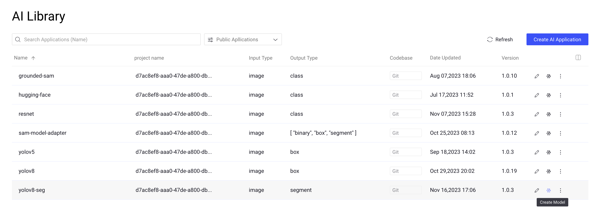
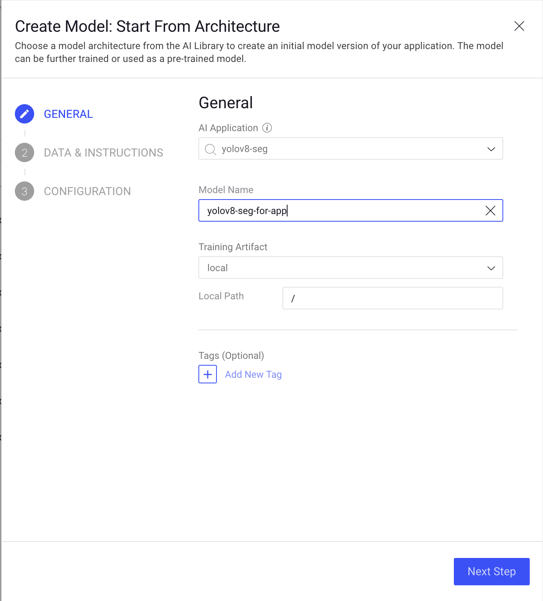
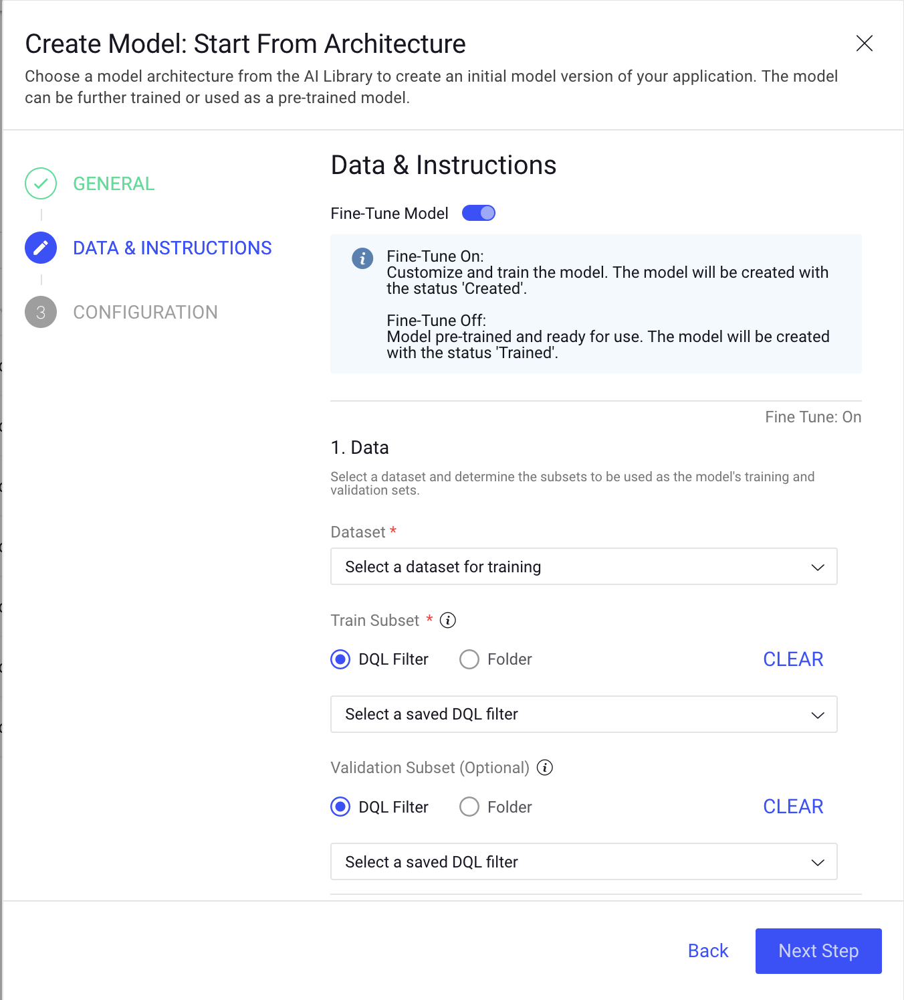
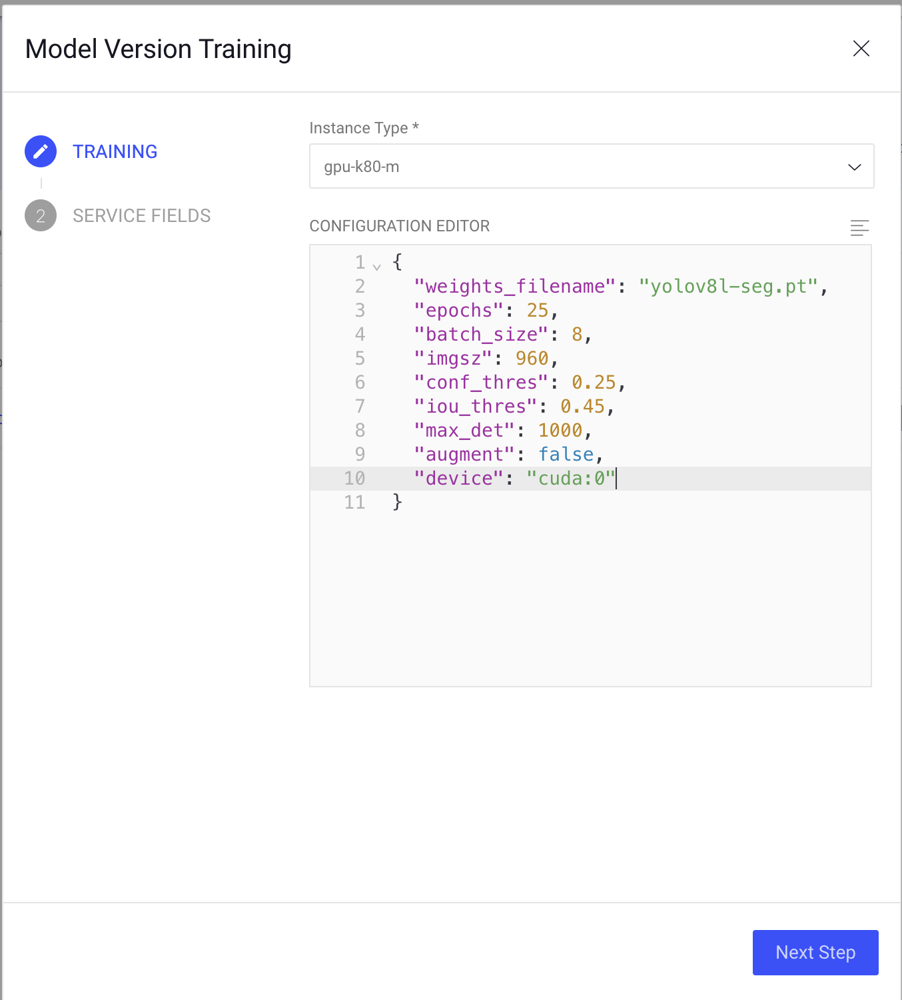
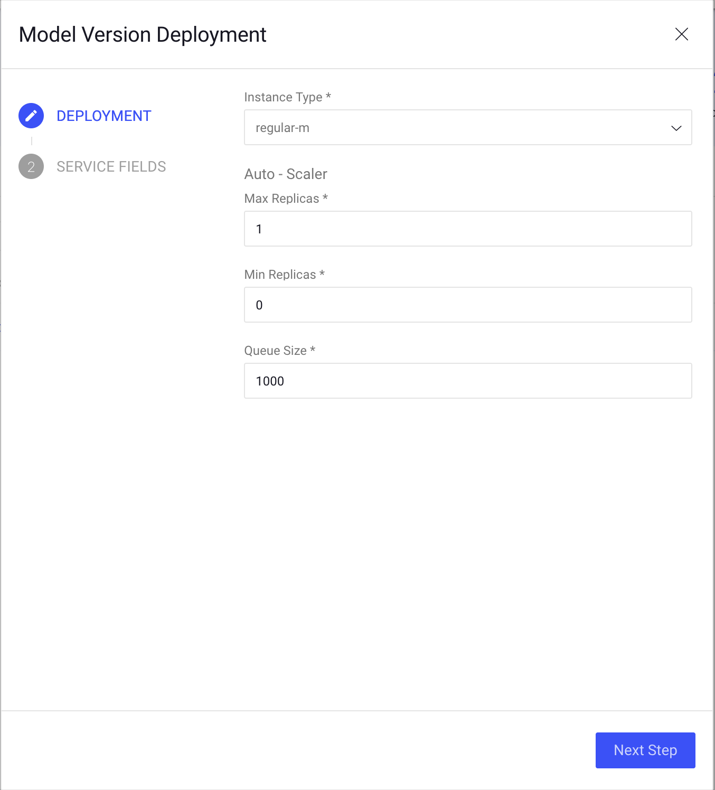
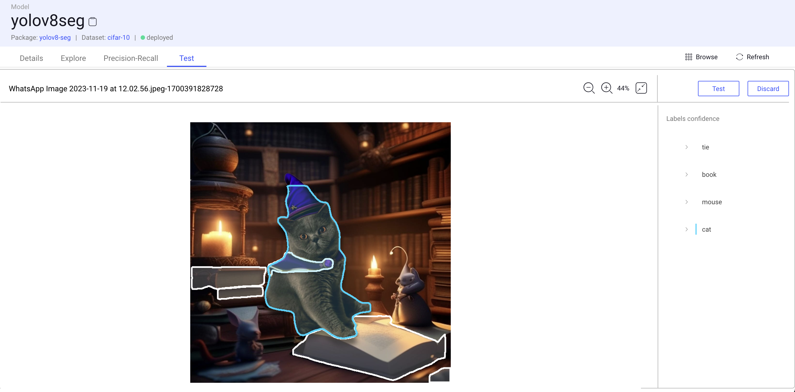

# Tutorial: Model Management from the Dataloop Platform  
  
In this tutorial we will go over all the steps necessary to manage a model using the Dataloop platform. We will cover how to:  
  
* Create a model based on a publicly available architecture from our AI Library  
* Finetune the model on your own data  
* Deploy the model as a service  
* Test the model's predictions  
* Use the model in a pipeline  
  
## Creating a model from a public architecture  
  
In the model management page, choose the AI Library button in the menu and in the drop-down menu, pick "Public Models" to see all the publicly available models. Choose a model from the list and you can create a copy of it by selecting the "create model" option as presented here:  
  
  
  
You will be presented with the options to choose name, artifact location and tags:  
  
  
  
Then to choose between fine-tuning or just choosing the pretrained weights available with the model. If you choose the pretrained weights, the model will be created with status ```trained```, otherwise, when choosing fine-tuning, you have to select a dataset, define the DQL filter or folder for the training and validation subsets, and choose a recipe for training. The model will be created with status created and you will need to run the training for it before it can be used.  
  
  
  
Lastly, define the model configurations:  
  
  
  
After this, the model will appear in the list of the proejct models in Model Management with the name you chose. It can be trained, evaluated and deployed.  
  
## Fine-tuning a model  
  
In the Model Management page of your project, find the version of the chosen model with the status created and click the three dots in the right of the model's row and select the "Train" option:  
  
  
  
Edit the configuration for this specific run of the training, and choose which instance in which it will run:  
  
  
  
and select the service fields (more information [here](https://developers.dataloop.ai/tutorials/faas/custom_environment_using_docker/chapter/)):  
  
  
  
Now kick back and wait for the training to finish.  
  
## Deployment  
  
After installing the pretrained model or fine-tuning it on your data, it is necessary to deploy it, so it can be used for prediction.  
  
In the Model Management page of your project, find a pretrained or fine-tuned version of your YOLOv8-segmentation model and click the three dots in the right of the model's row and select the "Deploy" option:  
  
  
  
Here you can choose the instance, minimum and maximum number of replicas and queue size of the service that will run the deployed model (for more information on these parameters, check [the documentation](https://developers.dataloop.ai/tutorials/faas/advance/chapter/#autoscaler)):  
  
  
  
Proceed to the next page and define the service fields (which are explained [here](https://developers.dataloop.ai/tutorials/faas/custom_environment_using_docker/chapter/)).  
  
  
  
After this, your model is deployed and ready to run inference.  
  
## Testing  
  
Once the model is deployed, you can test it by going to the Model Management, selecting the model you have trained and then going to the test tab. Drag and drop or select an image to the image area:  
  
  
  
click the test button and wait for the prediction to be done:  
  
  
  
## Predicing with a pipeline  
  
The best way to perform predictions in the platform is to add a "Predict Node" to a pipeline:  
  
  
  
Click [here](https://developers.dataloop.ai/onboarding/08_pipelines/) for more information on Dataloop Pipelines.  
